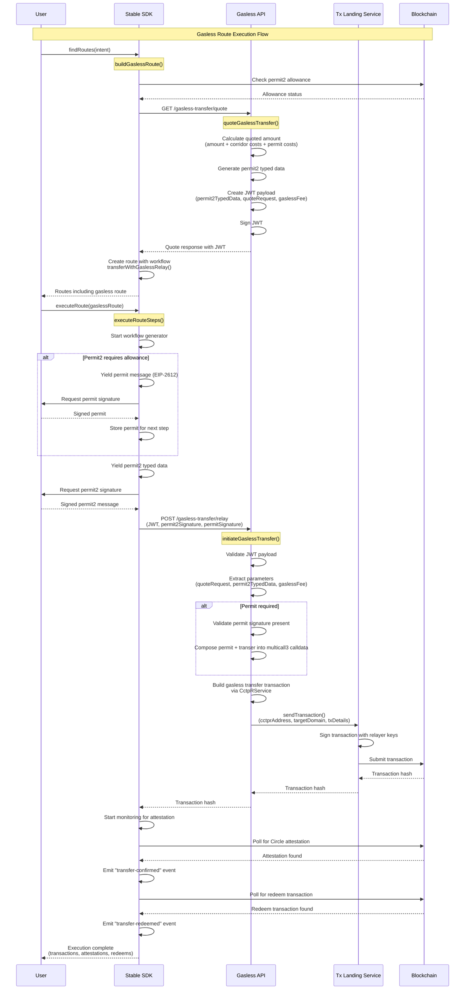

# Gassless Relaying:
### What is it?
Feature added to CCTPR contract to allow the user to use all transfer features, paying only in usdc (no gas token).
### How does it work?
We use a permit2 typed message signed by the user to grant CCTPR spending power over the user tokens.
An offchain estimates the cost of relaying and triggers a relay for that exact quote.
CCTPR performs the transfer and re-imburses the relayer, adding a configurable fee.

> Permit2 is public infrastructure by uniswap and the user needs to sign a permit for it.

### Components:
- **CCTPR Contract:** Underlying on-chain infrastructure to support gasless.
- **SDK:** Provides the interface to the client.
- **Gasless API:** quotes and authorizes the relay.
- **Tx Landing Service:** Gets the transaction included.

### High Level Operations flow:
1. Check user's allowance on permit2 and determine if a permit is needed
2. Get a quote from the gasless-api. The quote is estimated, signed, and returned to the user.
3. User signs required permits (might be one or two depending on step 1) and requests them to be relayed
4. Gasless-api verifies the signature of the transfers parameters
5. If a permit is required, permit and transfer are batched using multicall3
6. Transaction is sent to transaction-landing-service for inclusion
5. Transaction hash is returned to the user, tracking is triggered as any route

### Flow Of Operations - Diagram:

